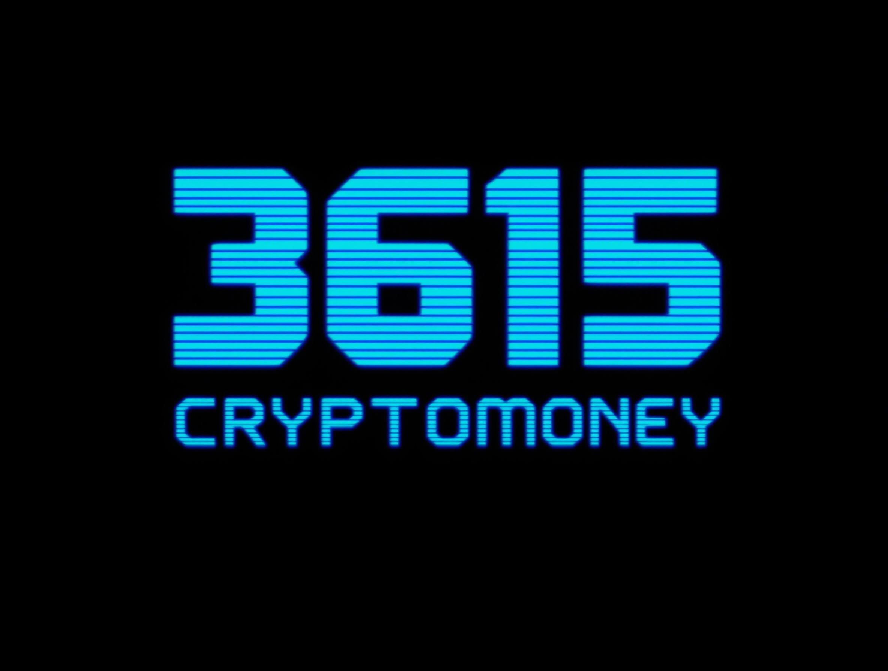

# 3615 CRYPTO(MONEY) 🪙📈

  

## Description

3615 CRYPTO(MONEY) est un script PHP qui utilise l'API de Coingecko pour récupérer et afficher les prix des cryptomonnaies sur un Minitel via la passerelle MiniPavi. Ce projet est conçu pour fonctionner avec un environnement spécifique et nécessite des fichiers externes pour fonctionner correctement.

## Fichiers

### `index.php` 📄

Le point d'entrée principal du script. Ce fichier gère l'initialisation du contexte utilisateur, la récupération des prix des cryptomonnaies, et l'affichage des informations sur le Minitel.

### `MiniCrypto.php` 📄

Contient les fonctions utilisées par `index.php` pour récupérer les prix des cryptomonnaies depuis l'API de Coingecko.

## Fonctionnalités

- **Récupération des prix des cryptomonnaies** 💸 : Utilise l'API de Coingecko pour obtenir les prix actuels des cryptomonnaies suivantes en Euros (€) et Dollars Américains ($) :
  - Bitcoin (BTC)
  - Ethereum (ETH)
  - Ripple (XRP)
  - Binance Coin (BNB)
  - Solana (SOL)
  - Tron (TRX)
  - Dogecoin (DOGE)
  - Cardano (ADA)

- **Affichage sur Minitel** 📺 : Envoie les informations récupérées à un Minitel via la passerelle MiniPavi, permettant une consultation rétro et originale des données.

- **Gestion de la navigation utilisateur** 🔄 : Offre une interface intuitive permettant à l'utilisateur de naviguer facilement entre différentes étapes, telles que l'accueil et l'affichage des prix des cryptomonnaies.

## Configuration

- **MiniPaviCli.php** 🛠️ : Ce fichier doit être présent dans le même répertoire et configuré pour fonctionner avec votre environnement MiniPavi.
- **btc.vdt** 📜 : Fichier contenant le contenu vidéotex à afficher sur le Minitel.

## Utilisation

1. Assurez-vous que tous les fichiers nécessaires (`MiniPaviCli.php`, `btc.vdt`) sont présents dans le répertoire.
2. Configurez votre serveur web pour exécuter des scripts PHP.
3. Accédez à `index.php` via votre navigateur ou votre Minitel pour voir les prix des cryptomonnaies.

## Auteur

- **RenaudG** 👨‍💻

## Version 🔄

- **0.4** (Avril 2025) 📅

## Ressources 📚

🔗 [minipavi](http://www.minipavi.fr)

🔗 [minipaviCli](https://github.com/ludosevilla/minipaviCli)

🔗 [Import Miedit](https://www.minipavi.fr/miedit/minipavi-expMiedit.html)

🔗 [Miedit](https://minitel.cquest.org/)

## Remarques 📝

- Ce script est conçu pour un usage spécifique avec un Minitel et la passerelle MiniPavi.
- Les erreurs sont masquées pour éviter d'afficher des informations sensibles à l'utilisateur final.
- Le script utilise des commandes spécifiques au Minitel pour gérer l'affichage et la navigation.

---

Pour toute question ou suggestion, veuillez contacter l'auteur. 📧
