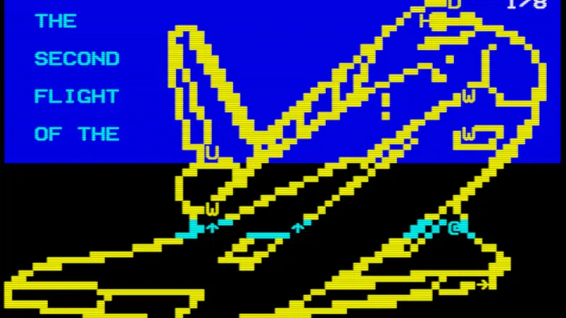

# 3615 ISS 🚀🌌

  

## Description

3615 ISS est un script PHP qui utilise des API pour récupérer et afficher des informations sur la Station Spatiale Internationale (ISS) et ses astronautes sur un Minitel via la passerelle MiniPavi. Ce projet est conçu pour fonctionner avec un environnement spécifique et nécessite des fichiers externes pour fonctionner correctement.

## Fichiers

### `index.php` 📄

Le point d'entrée principal du script. Ce fichier gère l'initialisation du contexte utilisateur, la récupération des informations sur l'ISS et les astronautes, et l'affichage des informations sur le Minitel.

### `mini_iss.php` 📄

Contient les fonctions utilisées par `index.php` pour récupérer les informations sur l'ISS et les astronautes depuis les API correspondantes.

## Fonctionnalités

- **Récupération des informations sur l'ISS** 🛰️ : Utilise des API pour obtenir les informations actuelles sur la position de l'ISS et les astronautes à bord.
- **Affichage sur Minitel** 📺 : Envoie les informations récupérées à un Minitel via la passerelle MiniPavi, permettant une consultation rétro et originale des données.
- **Gestion de la navigation utilisateur** 🔄 : Offre une interface intuitive permettant à l'utilisateur de naviguer facilement entre différentes étapes, telles que l'accueil, l'affichage des astronautes et la position de l'ISS.

## Configuration

- **MiniPaviCli.php** 🛠️ : Ce fichier doit être présent dans le même répertoire et configuré pour fonctionner avec votre environnement MiniPavi.
- **iss.vdt** 📜 : Fichier contenant le contenu vidéotex à afficher sur le Minitel.

## Utilisation

1. Assurez-vous que tous les fichiers nécessaires (`MiniPaviCli.php`, `iss.vdt`) sont présents dans le répertoire.
2. Configurez votre serveur web pour exécuter des scripts PHP.
3. Accédez à `index.php` via votre navigateur ou votre Minitel pour voir les informations sur l'ISS et les astronautes.

## Auteur

- **RenaudG** 👨‍💻

## Version 🔄

- **1.0** (Mai 2025) 📅

## Ressources 📚

🔗 [minipavi](http://www.minipavi.fr)

🔗 [minipaviCli](https://github.com/ludosevilla/minipaviCli)

🔗 [Import Miedit](https://www.minipavi.fr/miedit/minipavi-expMiedit.html)

🔗 [Miedit](https://minitel.cquest.org/)

## Remarques 📝

- Ce script est conçu pour un usage spécifique avec un Minitel et la passerelle MiniPavi.
- Les erreurs sont masquées pour éviter d'afficher des informations sensibles à l'utilisateur final.
- Le script utilise des commandes spécifiques au Minitel pour gérer l'affichage et la navigation.

---

Pour toute question ou suggestion, veuillez contacter l'auteur. 📧
