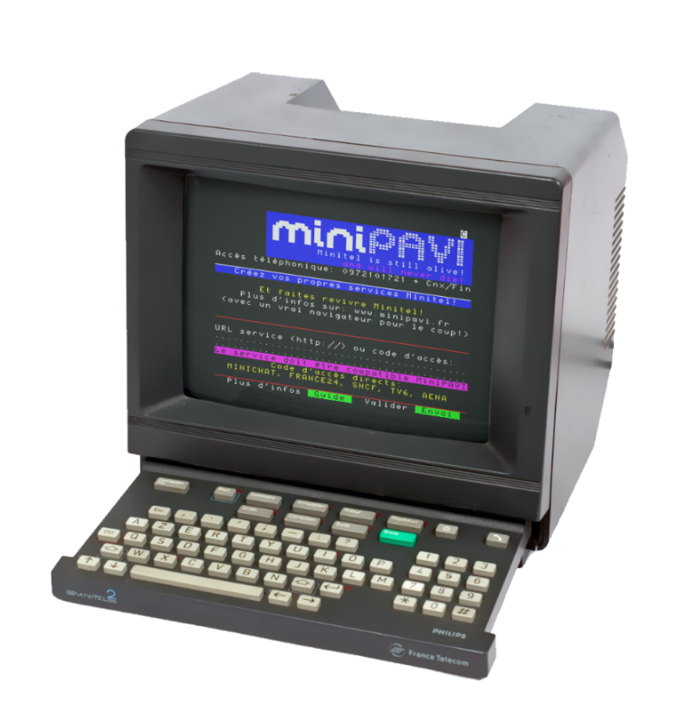

# 📟 MiniPavi Applications

<p align="center">
  
</p>

Bienvenue dans le dépôt des applications MiniPavi ! Ce dépôt contient quatre applications Minitel modernisées grâce à la passerelle MiniPavi. Chaque application exploite les capacités de MiniPavi pour offrir une expérience Minitel enrichie et interactive.

## 🛢️ 3613 CARBU

**3613 CARBU** est une application dédiée à la gestion et à l'affichage des informations sur les carburants. Elle permet aux utilisateurs de consulter les prix des carburants en temps réel et de recevoir des mises à jour régulières.

- **Fonctionnalités** :
  - Affichage des prix des carburants.
  - Mises à jour en temps réel.
  - Navigation simple via les touches du Minitel.

## 🧠 3614 MISTRAL

**3614 MISTRAL** est une application qui utilise l'API Mistral AI pour fournir des interactions intelligentes et des réponses basées sur l'intelligence artificielle. Grâce à MiniPavi, les utilisateurs peuvent accéder à des services avancés d'IA directement depuis leur Minitel.

- **Fonctionnalités** :
  - Interactions basées sur l'IA.
  - Réponses intelligentes et contextuelles.
  - Intégration avec l'API Mistral AI pour des fonctionnalités avancées.

## 🪙 3615 CRYPTO

**3615 CRYPTO** est une application dédiée aux cryptomonnaies. Elle permet aux utilisateurs de suivre les cours des principales cryptomonnaies en temps réel, directement sur leur Minitel.

- **Fonctionnalités** :
  - Suivi des cours des cryptomonnaies.
  - Mises à jour en temps réel.
  - Navigation fluide entre les différentes cryptomonnaies.

## 🎰 3615 LOTO

**3615 LOTO** est une application qui permet aux utilisateurs de consulter les résultats des derniers tirages du Loto ainsi que de l'Euromillions. Grâce à MiniPavi, les utilisateurs peuvent accéder facilement aux résultats des jeux de hasard directement depuis leur Minitel.

- **Fonctionnalités** :
  - Consultation des résultats du dernier tirage du Loto.
  - Consultation des résultats du dernier tirage de l'Euromillions.
  - Mises à jour en temps réel des résultats.

## 🚀 Utilisation de la Passerelle MiniPavi

Ces applications utilisent la passerelle MiniPavi pour communiquer avec les services Minitel. MiniPavi permet de moderniser les services Minitel en utilisant des technologies web comme les websockets et HTTP.

- **Avantages de MiniPavi** :
  - Compatibilité avec les émulateurs Minitel modernes.
  - Facilité de développement grâce à l'utilisation de langages web.
  - Support pour le contenu multimédia via l'interface WebMedia.

## 🛠️ Installation et Configuration

Pour installer et configurer ces applications, suivez les instructions ci-dessous :

1. **Cloner le dépôt** :
   ```bash
   git clone https://github.com/renaudgweb/miniservices.git
   cd miniservices
   ```

2. **Configurer les applications** :
      - Assurez-vous d'avoir un serveur web configuré pour exécuter les scripts PHP.
      - Configurez les fichiers de configuration pour chaque application selon vos besoins.

3. **Lancer les applications** :
      - Accédez aux applications via un émulateur Minitel ou un véritable terminal Minitel connecté à MiniPavi.

## 🚀 Exemple de code

**DisplayPaginatedText.php**
```php
case 10:
    if (MiniPavi\MiniPaviCli::$fctn == 'SOMMAIRE') {
        $step = 0; // Retour au sommaire
        $context['objDisplayPaginatedText'] = '';
        break;
    }
    // Récupération de l'éventuel objet existant dans le contexte utilisateur
    $objDisplayPaginatedText = @$context['objDisplayPaginatedText'];
    if (!($objDisplayPaginatedText instanceof DisplayPaginatedText)) {
        // L'utilisateur n'a pas l'objet dans son contexte : il vient d'arriver sur cette rubrique
        // Fond de page
        $vdtStart = MiniPavi\MiniPaviCli::clearScreen();
        $vdtStart .= file_get_contents('fond-de-page.vdt');
        // Effacement du texte affiché
        $vdtClearPage .= MiniPavi\MiniPaviCli::setPos(3, 23);
        $vdtClearPage .= VDT_TXTBLACK . VDT_FDNORM . MiniPavi\MiniPaviCli::repeatChar(' ', 33);
        for ($i = 0; $i < 18; $i++) {
            $vdtClearPage .= MiniPavi\MiniPaviCli::setPos(1, 21 - $i);
            $vdtClearPage .= VDT_BGBLUE . MiniPavi\MiniPaviCli::repeatChar(' ', 33);
        }
        // fichier contenant le texte
        $textFilename = 'le-texte.txt';
        // titre Cyan , double hauteur
        $vdtPreTitle = VDT_TXTCYAN . VDT_SZDBLH;
        // Position du titre
        $lTitle = 2;
        $cTitle = 11;
        // Position du compteur de page
        $lCounter = 21;
        $cCounter = 35;
        // Compteur de page couleur Cyan
        $vdtPreCounter = VDT_TXTCYAN;
        // Position début du texte
        $lText = 5;
        $cText = 2;
        // Longueur maximum d'une ligne
        $maxLengthText = 38;
        // Couleur normale : jaune
        $normalColor = VDT_TXTYELLOW;
        // Couleur spéciale : blanc
        $specialColor = VDT_TXTWHITE;
        // Rien de particulier à afficher avant chaque ligne
        $vdtPreText = '';
        // Bas de page si ni Suite ni Retour acceptés (Sommaire n'est pas gérée par l'objet, mais directement par le script)
        $vdtNone = MiniPavi\MiniPaviCli::setPos(3, 23) . VDT_TXTBLACK . VDT_FDINV . " Sommaire ";
        // Bas de page si uniquement Suite accepté
        $vdtSuite = MiniPavi\MiniPaviCli::setPos(3, 23) . VDT_TXTBLACK . VDT_FDINV . " Suite " . VDT_FDNORM . " ou " . VDT_FDINV . " Sommaire ";
        // Bas de page si uniquement Retour accepté
        $vdtRetour = MiniPavi\MiniPaviCli::setPos(3, 23) . VDT_TXTBLACK . VDT_FDINV . " Retour " . VDT_FDNORM . " ou " . VDT_FDINV . " Sommaire ";
        // Bas de page si Suite et Retour acceptés
        $vdtSuiteRetour = MiniPavi\MiniPaviCli::setPos(3, 23) . VDT_TXTBLACK . VDT_FDINV . " Suite " . VDT_FDNORM . " " . VDT_FDINV . " Retour " . VDT_FDNORM . " ou " . VDT_FDINV . " Sommaire ";
        // Message d'erreur si première page atteinte et appui sur Retour
        $vdtErrNoPrev = MiniPavi\MiniPaviCli::toG2("Première page !");
        // Message d'erreur si dernière page atteinte et appui sur Suite
        $vdtErrNoNext = MiniPavi\MiniPaviCli::toG2("Dernière page !");
        // 16 lignes maximum par page
        $lines = 16;
        // initialisation
        $objDisplayPaginatedText = new DisplayPaginatedText(
            $vdtStart, $vdtClearPage, $textFilename, $lTitle, $cTitle, $vdtPreTitle,
            $lCounter, $cCounter, $vdtPreCounter, $lText, $cText,
            $maxLengthText, $normalColor, $specialColor, $vdtPreText, $vdtNone, $vdtSuite, $vdtRetour,
            $vdtSuiteRetour, $vdtErrNoPrev, $vdtErrNoNext, $lines
        );
        // Execution
        $r = $objDisplayPaginatedText->process('', $vdt);
    } else {
        // L'utilisateur a déjà l'objet dans son contexte, execution
        $r = $objDisplayPaginatedText->process(MiniPavi\MiniPaviCli::$fctn, $vdt);
    }
    // A ce stade, $vdt contient le code videotex à envoyer à l'utilisateur
    // On conserve l'objet dans le contexte utilisateur pour le récupérer lors de sa prochaine action
    $context['objDisplayPaginatedText'] = $objDisplayPaginatedText;
    // On ne change pas la valeur de $step car à la prochaine action on exécute de nouveau cette partie du script
    break 2;
```

**DisplayList.php**
```php
case 20:
    if (MiniPavi\MiniPaviCli::$fctn == 'SOMMAIRE') {
        $step = 10; // Retour au sommaire
        $context['objDisplayList'] = '';
        break;
    }

    // Liste des éléments
    $list = array(
        0 => '1er choix',
        1 => '2ème choix',
        2 => '3ème choix',
        3 => '4ème choix'
    );

    // Récupération de l'éventuel objet existant dans le contexte utilisateur
    $objDisplayList = @$context['objDisplayList'];
    if (!($objDisplayList instanceof DisplayList)) {
        // L'utilisateur n'a pas l'objet dans son contexte : il vient d'arriver sur cette rubrique
        $vdtStart = MiniPavi\MiniPaviCli::clearScreen();
        $vdtStart .= file_get_contents('fond-de-page.vdt');

        // Effacement du texte affiché
        $vdtClearPage .= MiniPavi\MiniPaviCli::setPos(3, 23);
        $vdtClearPage .= VDT_TXTBLACK . VDT_FDNORM . MiniPavi\MiniPaviCli::repeatChar(' ', 33);
        for ($i = 0; $i < 18; $i++) {
            $vdtClearPage .= MiniPavi\MiniPaviCli::setPos(1, 21 - $i);
            $vdtClearPage .= VDT_BGBLUE . MiniPavi\MiniPaviCli::repeatChar(' ', 33);
        }

        // Position du compteur de page
        $lCounter = 21;
        $cCounter = 35;

        // Compteur de page couleur Cyan
        $vdtPreCounter = VDT_TXTCYAN;

        // Position début du texte
        $lText = 5;
        $cText = 2;

        // On affiche rien de spécial avant chaque élément
        $vdtPreText = '';

        // Bas de page si ni Suite ni Retour acceptés (Sommaire n'est pas géré par l'objet, mais directement par le script)
        $vdtNone = MiniPavi\MiniPaviCli::setPos(3, 23) . VDT_TXTBLACK . MiniPavi\MiniPaviCli::toG2("N°+ ") . VDT_FDINV . " Envoi " . VDT_FDNORM . " ou " . VDT_FDINV . " Sommaire ";

        // Bas de page si uniquement Suite accepté
        $vdtSuite = MiniPavi\MiniPaviCli::setPos(3, 23) . VDT_TXTBLACK . MiniPavi\MiniPaviCli::toG2("N°+ ") . VDT_FDINV . " Envoi " . VDT_FDNORM . " " . VDT_FDINV . " Suite " . VDT_FDNORM . " ou " . VDT_FDINV . " Somm. ";

        // Bas de page si uniquement Retour accepté
        $vdtRetour = MiniPavi\MiniPaviCli::setPos(3, 23) . VDT_TXTBLACK . MiniPavi\MiniPaviCli::toG2("N°+ ") . VDT_FDINV . " Envoi " . VDT_FDNORM . " " . VDT_FDINV . " Retour " . VDT_FDNORM . " ou " . VDT_FDINV . " Somm. ";

        // Bas de page si Suite et Retour acceptés
        $vdtSuiteRetour = MiniPavi\MiniPaviCli::setPos(3, 23) . VDT_TXTBLACK . MiniPavi\MiniPaviCli::toG2("N°+ ") . VDT_FDINV . " Envoi " . VDT_FDNORM . " " . VDT_FDINV . " Suite " . VDT_FDNORM . " " . VDT_FDINV . " Retour " . VDT_FDNORM;

        // Message d'erreur si première page atteinte et appui sur Retour
        $vdtErrNoPrev = MiniPavi\MiniPaviCli::toG2("Première page !");

        // Message d'erreur si dernière page atteinte et appui sur Suite
        $vdtErrNoNext = MiniPavi\MiniPaviCli::toG2("Dernière page !");

        // Message d'erreur si choix incorrect saisi
        $vdtErrChoice = MiniPavi\MiniPaviCli::toG2("Choix incorrect !");

        // 8 éléments maximum par page
        $lines = 8;

        // 1 ligne vide entre chaque élément
        $spaceLines = 1;

        // Le numéro de l'élément sera sur fond bleu, texte vert, inversé.
        // Le signe # représente le numéro de l'élément et est modifié à la volée
        $vdtItemNum = VDT_BGBLUE . VDT_TXTGREEN . VDT_FDINV . ' # ' . VDT_FDNORM . VDT_TXTYELLOW;

        // Initialisation
        $objDisplayList = new DisplayList(
            $vdtStart,
            $vdtClearPage,
            $list,
            $lCounter,
            $cCounter,
            $vdtPreCounter,
            $vdtItemNum,
            $lText,
            $cText,
            $vdtPreText,
            $vdtNone,
            $vdtSuite,
            $vdtRetour,
            $vdtSuiteRetour,
            $vdtErrNoPrev,
            $vdtErrNoNext,
            $vdtErrChoice,
            $lines,
            $spaceLines
        );

        // Exécution
        $r = $objDisplayList->process('', '', $vdt);
    } else {
        // L'utilisateur a déjà l'objet dans son contexte, exécution
        $r = $objDisplayList->process(MiniPavi\MiniPaviCli::$fctn, MiniPavi\MiniPaviCli::$content[0], $vdt);
    }

    // On conserve l'objet dans le contexte utilisateur pour le récupérer lors de sa prochaine action
    $context['objDisplayList'] = $objDisplayList;

    // Attente d'une saisie
    $cmd = MiniPavi\MiniPaviCli::createInputTxtCmd(34, 23, 2, MSK_ENVOI | MSK_SOMMAIRE | MSK_REPETITION | MSK_SUITE | MSK_RETOUR, true, ' ', '');

    if ($r == -1 || $r === false) {
        // L'utilisateur n'a pas saisi de choix (ou choix invalide)
        break 2;
    }

    // Un choix valide a été saisi, $r représente l’index du choix dans $list
    // On traite le choix saisi
    $vdt .= MiniPavi\MiniPaviCli::writeLine0('Choix = ' . $list[$r]);
    break 2;
```

## 📚 ressources

🔗 [Import Miedit](https://www.minipavi.fr/miedit/minipavi-expMiedit.html)

🔗 [MiEdit](https://minitel.cquest.org/)

🔗 [minipaviCli](https://github.com/ludosevilla/minipaviCli)

## 📬 Contact

Pour toute question ou suggestion, n'hésitez pas à ouvrir une issue ou à me contacter directement.
